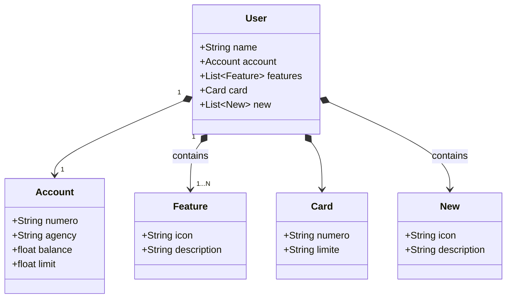

# Santander Dev Week 2024
Java RESTfull API criando para o SANTANDER DEV WEEK.

## Diagrama de Classes

```mermaid
classDiagram
    class User {
        +String name
        +Account account
        +List~Feature~ features
        +Card card
        +List~New~ new
    }

    class Account {
        +String numero
        +String agency
        +float balance
        +float limit
    }

    class Feature {
        +String icon
        +String description
    }

    class Card {
        +String numero
        +String limite
    }

    class New {
        +String icon
        +String description
    }

    User "1" *--> "1" Account
    User "1" *--> "1...N" Feature : contains
    User *--> Card
    User *--> New : contains
```
